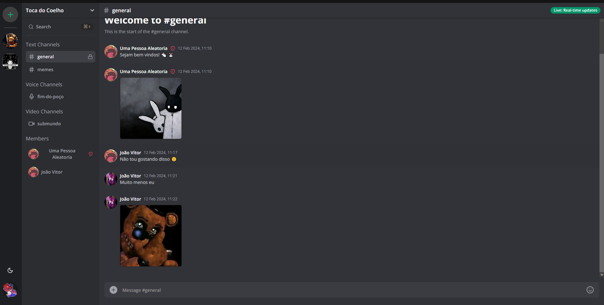
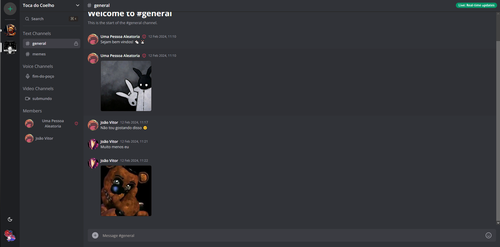
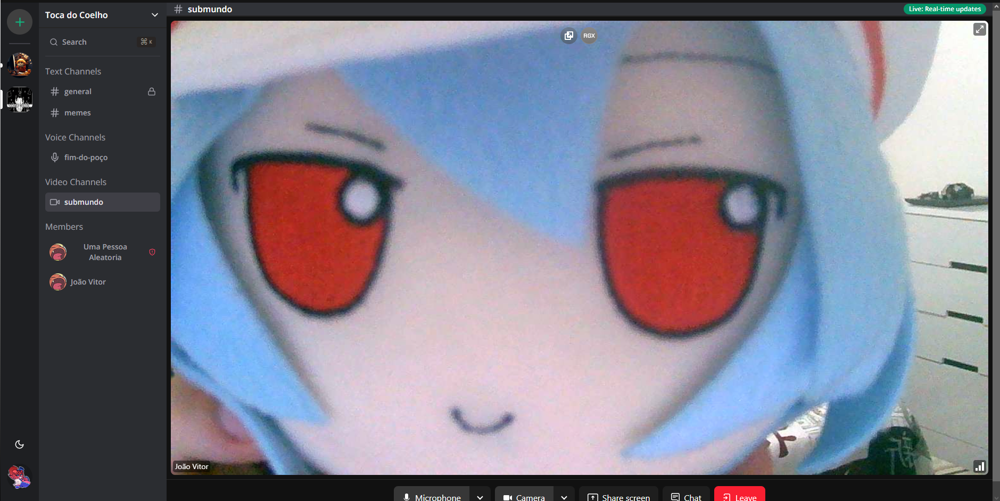
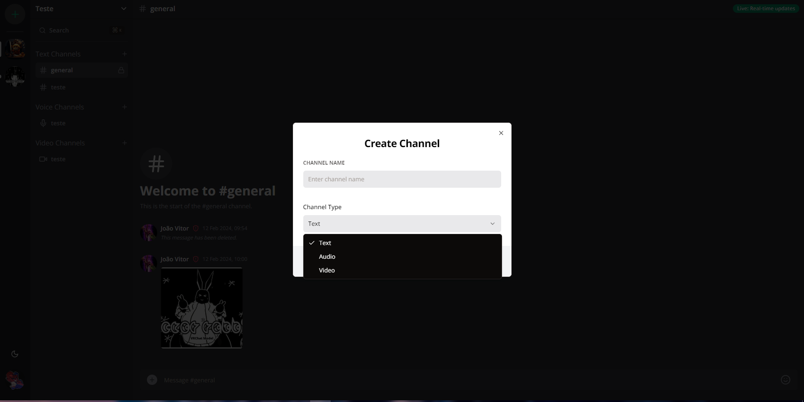
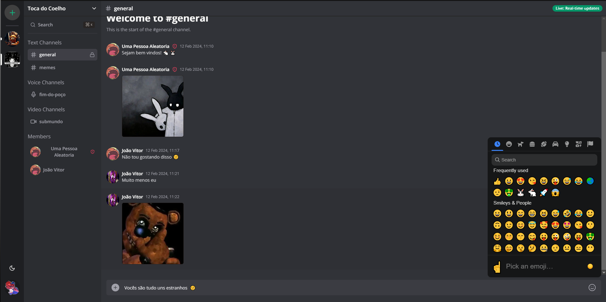

<h1 align="center">Discord App Clone</h1>

    <a href="#sobre">Sobre</a> | <a href="#tecnologias">Tecnologias</a> | <a href="#run">Rodando o projeto</a>

## 🚀 Sobre

Não tem o que explicar, tudo o que eu fiz para refazer o discord 100% funcional no NextJS, com comunicação em tempo real, WebRTC, cliente de autenticação externo upload de imagem e mais uma porrada de coisa que tou com preguiça de falar o que é.

## :computer: Tecnologias

### Web

### Infra

### Executando a aplicação

Configurando as variáveis de ambiente:

### 1. **Clerk**

- **Pegando as credenciais**:
  - Para obter as credenciais do Clerk, você precisa se inscrever no [Clerk Dashboard](https://dashboard.clerk.dev/).
  - Após criar uma conta, faça login no Dashboard e navegue até a seção de configurações.
  - Lá você encontrará sua `CLERK_SECRET_KEY` e `NEXT_PUBLIC_CLERK_PUBLISHABLE_KEY`.

### 2. **UploadThing**

- **Pegando as credenciais**:
  - Acesse o site do [UploadThing](https://uploadthing.com) e crie uma conta.
  - Após fazer login, vá para a seção de configurações ou perfil.
  - Lá você encontrará sua `UPLOADTHING_SECRET` e `UPLOADTHING_APP_ID`.

### 3. **Banco de Dados (MySQL)**

- **Pegando as credenciais**:
  - Se você não tem um banco de dados MySQL configurado, você precisa instalá-lo localmente ou configurar um em um servidor remoto.
  - Após configurar o MySQL, você precisa criar um banco de dados para sua aplicação.
  - As credenciais serão o `DATABASE_URL`, onde você especifica o tipo de banco de dados, o nome do usuário, a senha, o host e a porta.

### 4. **LiveKit**

- **Pegando as credenciais**:
  - Acesse o [LiveKit Console](https://console.livekit.io/) e crie uma conta ou faça login.
  - No console, vá para a seção de API Keys.
  - Crie uma nova chave de API para sua aplicação. Isso gerará sua `LIVEKIT_API_KEY` e `LIVEKIT_API_SECRET`.

### 5. **Configurando as Variáveis de Ambiente**

- Depois de obter todas as credenciais necessárias, você pode configurar as variáveis de ambiente em seu ambiente de desenvolvimento ou servidor de produção seguindo o tutorial anterior.

Lembre-se sempre de manter suas credenciais seguras e não compartilhá-las com terceiros não autorizados. Utilize mecanismos seguros para armazenar e gerenciar essas credenciais, especialmente em ambientes de produção.
#### _Sinta-se livre para colaborar, toda ajuda é bem vinda ;)_

 